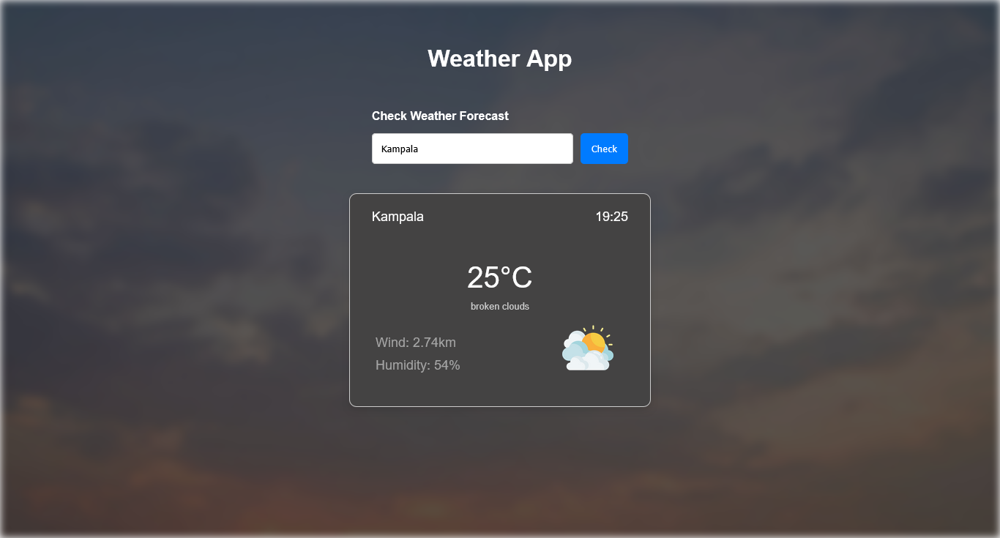
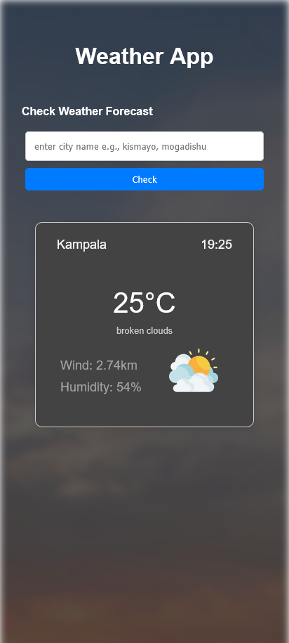

# Weather App

## Overview
The **Weather App** is a user-friendly web application that provides real-time weather updates for any location worldwide. It fetches weather data from a reliable API and displays current weather conditions, temperature, humidity, wind speed, may be in future it will display 7-day forecast.

## Screen Shot




## Features
- 🌍 **Global Weather Data** – Get weather updates for any city or location.
- ⏳ **Real-Time Updates** – Displays live temperature, humidity, and wind speed.
- 🎨 **User-Friendly UI** – Clean and responsive design for easy navigation.
- 📍 **Location-Based Weather** – Uses GPS to fetch weather for your current location.

## Technologies Used
- **HTML, CSS, JavaScript** – Frontend development.
- **Weather API** – Fetch real-time weather data.
- **Git & GitHub** – Version control.

## Installation
1. Clone the repository:
   ```sh
   git clone https://github.com/your-username/weather-app.git
   ```
2. Navigate to the project folder:
   ```sh
   cd weather-app
   ```
3. Open `index.html` in a browser or use Live Server.

## API Setup
1. Sign up at [Weather API Provider](https://example.com) and get an API key.
2. Add the API key in your JavaScript file:
   ```js
   const apiKey = 'YOUR_API_KEY';
   ```

## Usage
1. Enter a city name in the search bar and get real-time weather updates.
2. wait until you get the final respond this may take few minutes


## Contributing
Feel free to contribute to the project by submitting a pull request or reporting issues.


## Contact
For any queries or collaboration opportunities, reach out via [ojaziz88@gmail.com].

